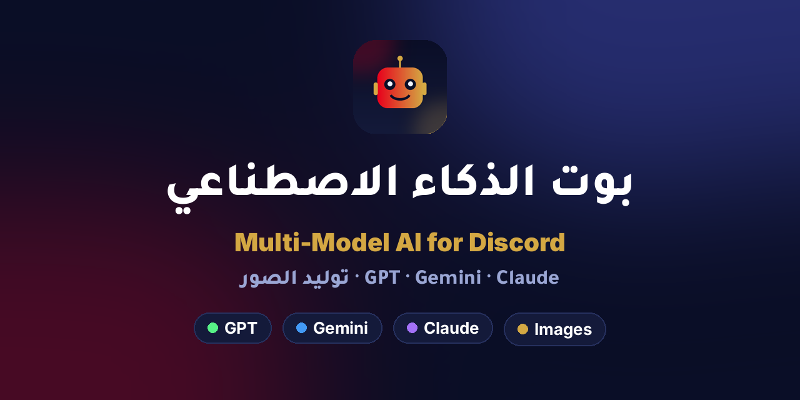
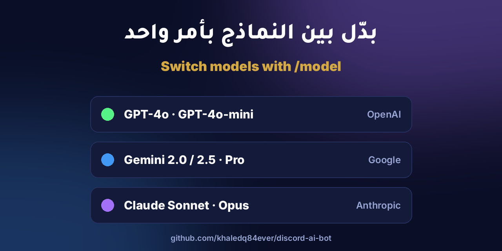
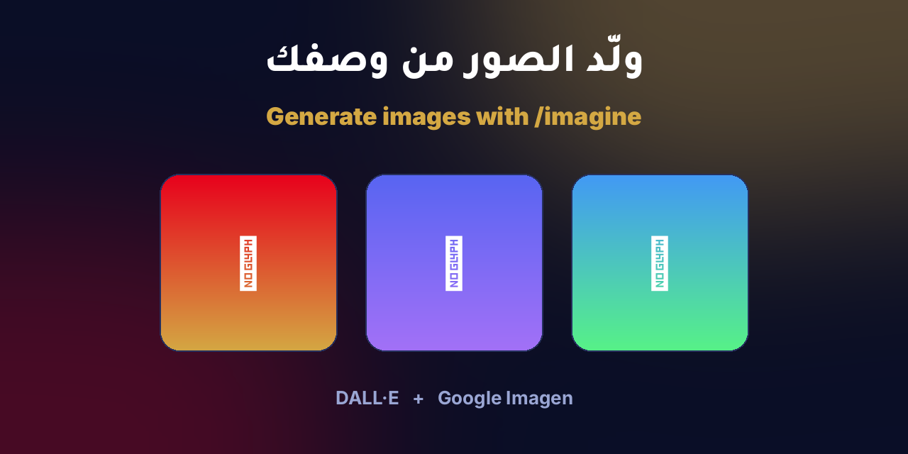
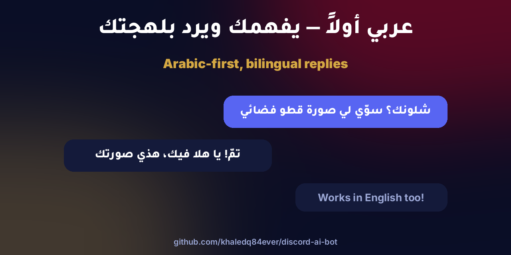
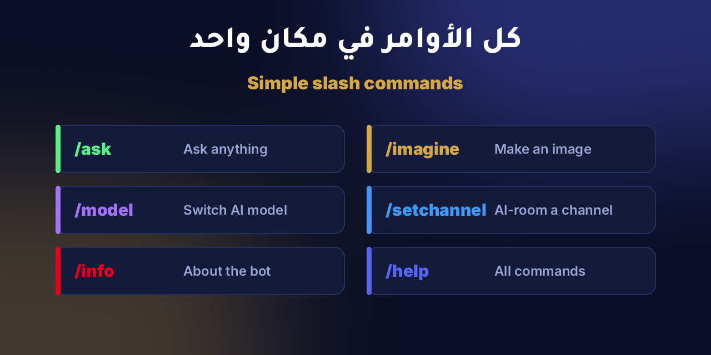

# 🤖 Multi-Model AI Discord Bot (Arabic-first)



دردشة ذكاء اصطناعي داخل ديسكورد مع GPT و Gemini و Claude + توليد الصور.
Chat with GPT / Gemini / Claude inside Discord, plus image generation.

| | |
|---|---|
|  |  |
|  |  |

## Features / المميزات
- **AI chat rooms** — mark a channel with `/setchannel`; the bot reads every
  message in real time and replies with context (stored in a live SQLite DB).
- **Switch models** with `/model` — GPT-4o, Gemini, Claude.
- **Image generation** with `/imagine` — free on a Gemini key
  (`gemini-2.5-flash-image`), or OpenAI DALL·E if you have a paid key.
- **Arabic-first**: detects language, replies in Arabic or English to match.

**Live:** one-click add page → https://discordbot-khaledq8s-projects.vercel.app

## 1. Discord setup
1. https://discord.com/developers/applications → **New Application**.
2. **Bot** tab → **Reset Token** → copy it into `DISCORD_TOKEN`.
3. Under **Privileged Gateway Intents**, enable **MESSAGE CONTENT INTENT**.
4. **OAuth2 → URL Generator**: scopes `bot` + `applications.commands`;
   bot permissions: *Send Messages, Read Message History, Embed Links,
   Attach Files, Use Slash Commands*. Open the generated URL to invite it.

## 2. Get API keys
- **Gemini (FREE):** https://aistudio.google.com/apikey → `GOOGLE_API_KEY`
- **OpenAI (paid):** https://platform.openai.com/api-keys → `OPENAI_API_KEY`
- **Claude (paid):** https://console.anthropic.com → `ANTHROPIC_API_KEY`

## 3. Run locally
```bash
pip install -r requirements.txt
cp .env.example .env        # fill in DISCORD_TOKEN + at least GOOGLE_API_KEY
python3 bot.py
```

Test just the AI (no Discord needed):
```bash
GOOGLE_API_KEY=your-free-key python3 test_gemini.py
```

## 4. Deploy on Railway
```bash
railway init
railway up
```
- Add your env vars in the Railway dashboard (Variables tab).
- Add a **Volume** mounted at `/data` so conversation history persists.

## Usage / الاستخدام
1. In your AI channel run `/setchannel`.
2. (Optional) `/model` to pick GPT / Gemini / Claude.
3. Just type — the bot replies. Or use `/ask` and `/imagine` anywhere.
